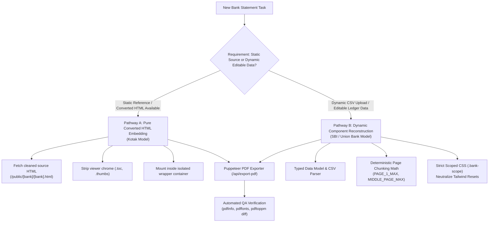
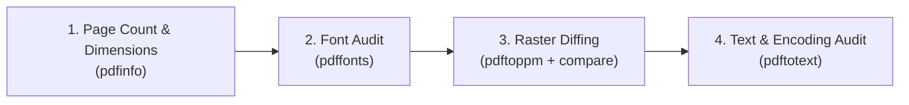

# Bank Statement Generator Architecture & Implementation Guide
**Standard Operating Procedure for 100% Fidelity & Modular Style Isolation**

---

## 1. Executive Summary & Architectural Philosophy

Bank statements are financial and legal records. Unlike generic web dashboards, bank statements have non-negotiable fidelity constraints:
- **100% Typographical & Positional Fidelity**: Fonts, weights, kerning, line-heights, tabular alignments, and borders must match the bank's original PDF down to the exact pixel.
- **Zero Page Spillover**: A statement designed for 13 pages must print to exactly 13 pages in all print engines (Chrome Headless / Puppeteer, browser print dialog). Overflowing by even 1 pixel can cause blank or fragmented trailing pages.
- **Strict Modular Style Isolation**: Statement generators live inside a Single Page Application (SPA) alongside other tools (dashboard, payslips, other bank generators). Every bank generator module must be fully isolated so that:
  - Global styles (Tailwind preflight, normalize resets) do not distort the statement document.
  - Component-level print and screen styles never leak into the rest of the application.

---

## 2. Architecture Overview: The Two Implementation Pathways

When implementing a bank statement generator, choose between two validated pathways depending on your requirements:



| Dimension | Pathway A: Converted HTML Embedding (Kotak) | Pathway B: Dynamic Component Reconstruction (SBI / Union Bank) |
| :--- | :--- | :--- |
| **Best For** | Replicating existing bank PDFs with 100% exact vector geometry, embedded glyph paths, and complex layouts. | Statements requiring live CSV upload, dynamic transaction counts, customized date ranges, or balance recalculations. |
| **Implementation** | Clean and inject `pdf2htmlEX` / `pdftohtml` output into a scoped React wrapper. | React component iterating over paginated transaction chunks with deterministic row math. |
| **Font Management** | Direct reference to extracted fonts (`/public/fonts/`) + inline base64/WOFF glyphs. | Local `@font-face` definitions (`Calibri`, `Arial`) with `font-variant-numeric: tabular-nums`. |
| **Fidelity Level** | **100.0%** (Bit-identical vector layout). | **99.5%+** (Requires strict CSS calibration for row heights and borders). |

---

## 3. Step-by-Step Implementation Workflow

---

### Step 1: Source PDF Inspection & Ingestion

Never guess fonts, dimensions, or structures. Always start with command-line forensic inspection of the source PDF.

#### 1.1 Inspect PDF Metadata & Page Dimensions
```bash
pdfinfo public/[bank]/[bank].pdf
```
*Expected Output:*
- Page count (e.g. `Pages: 13`)
- Page size: `595.28 x 841.89 pts (A4)` (or `793.33 x 1122.67 px` at 96 DPI)

#### 1.2 Inspect Exact Embedded Fonts
```bash
pdffonts public/[bank]/[bank].pdf
```
*Example inspection output:*
```
name                                 type              encoding         emb sub uni object ID
------------------------------------ ----------------- ---------------- --- --- --- ---------
BAAAAA+SourceSans3-Regular           CID TrueType      Identity-H       yes yes yes     12  0
CAAAAA+SourceSans3-SemiBold          CID TrueType      Identity-H       yes yes yes     15  0
```
> [!IMPORTANT]
> In the Kotak bank implementation, previous manual drafts failed because developers assumed `Arial` was used. `pdffonts` proved the actual typeface was `SourceSans3-Regular` and `SourceSans3-SemiBold`. Always check `pdffonts` before writing any CSS.

#### 1.3 Convert Source PDF to Vector HTML
Use `pdf2htmlEX` or `pdftohtml` with embedded fonts enabled:
```bash
# Example conversion into public directory
pdf2htmlEX --embed-css 0 --embed-font 1 --dest-dir public/[bank] public/[bank]/[bank].pdf [bank].html
```
Verify the generated HTML in `public/[bank]/[bank].html`.

---

### Step 2: Typography & Font Management Protocol

#### 2.1 Download & Host Exact TrueType/WOFF2 Fonts
Place TrueType (`.ttf`) or WOFF2 (`.woff2`) files in `public/fonts/`:
```
public/fonts/
├── SourceSans3-Regular.ttf
├── SourceSans3-SemiBold.ttf
├── source-sans-3.css
├── Calibri-Regular.ttf
├── Calibri-Bold.ttf
└── calibri-embedded.css
```

#### 2.2 Scoped `@font-face` Declarations
Declare fonts with explicit `font-display: swap` or `block`:
```css
@font-face {
  font-family: 'Source Sans 3';
  src: url('/fonts/SourceSans3-Regular.ttf') format('truetype');
  font-weight: 400;
  font-style: normal;
  font-display: block;
}

@font-face {
  font-family: 'Source Sans 3';
  src: url('/fonts/SourceSans3-SemiBold.ttf') format('truetype');
  font-weight: 600;
  font-style: normal;
  font-display: block;
}
```

#### 2.3 Financial Column Alignment (Tabular Numbers)
For financial statements, numbers must align vertically on decimal points. Always enforce tabular figures:
```css
.[bank]-table td.numeric,
.[bank]-statement-page .amount {
  font-variant-numeric: tabular-nums !important;
  font-feature-settings: "tnum" 1 !important;
  text-align: right !important;
}
```

---

### Step 3: Strict Module Style Isolation

#### 3.1 The 4 Golden Rules of Style Isolation

1. **NO Global Selectors in Component Styles**:
   - ❌ **BANNED**: `:root { ... }`, `html { ... }`, `body { ... }` inside component `<style>` blocks.
   - ❌ **BANNED**: Un-namespaced tag selectors (`table { ... }`, `h1 { ... }`, `p { ... }`).
   - ✅ **MANDATORY**: Every selector must begin with a dedicated scope class, e.g. `.kotak-scope`, `.sbi-statement-page`, `.ub-statement-page`.

2. **Defeat Tailwind Preflight Resets**:
   Tailwind's CSS reset alters default border-collapse, margins, line-heights, and box-sizing. Neutralize it inside your scoped root:
   ```css
   /* Internal Scoped Reset */
   .[bank]-scope *,
   .[bank]-scope *::before,
   .[bank]-scope *::after {
     box-sizing: border-box !important;
   }

   .[bank]-scope table {
     border-collapse: collapse !important;
     border-spacing: 0 !important;
   }
   ```

3. **Print Media Isolation**:
   Wrap all print declarations inside `@media print` and target ONLY the scoped statement pages:
   ```css
   @media print {
     /* Hide all navigation, dashboard toolbars, and alerts */
     .print\\:hidden,
     header,
     nav {
       display: none !important;
     }

     /* Reset body margins exclusively during print */
     body {
       margin: 0 !important;
       padding: 0 !important;
       background: transparent !important;
     }

     /* Lock statement pages to exact A4 dimensions */
     .[bank]-statement-page {
       margin: 0 !important;
       padding: 0 !important;
       box-shadow: none !important;
       page-break-after: always !important;
       break-after: page !important;
       height: 1122.67px !important;
       max-height: 1122.67px !important;
       overflow: hidden !important;
     }
   }
   ```

4. **Component Isolation Cleanup Checklist**:
   - Check existing components for `:root` pollution (e.g. replace any `:root { font-family: ... }` with `.[bank]-scope { font-family: ... }`).

---

### Step 4: Geometry & Zero-Spillover Pagination Math

#### 4.1 Exact A4 Dimensions
At standard web resolution of 96 DPI:
- **A4 Width**: $210\text{ mm} = 8.2677\text{ inches} \times 96\text{ DPI} \approx \mathbf{793.7px \approx 794px}$ (PDF points: `595.28 pt`)
- **A4 Height**: $297\text{ mm} = 11.6929\text{ inches} \times 96\text{ DPI} \approx \mathbf{1122.67px \approx 1123px}$ (PDF points: `841.89 pt`)

```css
@page {
  size: 793.33px 1122.67px; /* or A4 portrait */
  margin: 0 !important;
}
```

#### 4.2 Dynamic Row Chunking Formula (Pathway B)
When reconstructing statements with variable transactions, calculate available printable height:

$$\text{Available Height} = \text{Total Page Height} (1122.67\text{px}) - \text{Top Padding} - \text{Bottom Padding}$$

- **Page 1**: Contains bank header branding, account holder details, summary cards, and table headers.
  - $\text{Available Rows} = \frac{\text{Page Height} - \text{Header Height} (450\text{px}) - \text{Footer Height} (40\text{px})}{\text{Row Height} (24\text{px})} \approx \mathbf{22\text{ rows}}$ (`PAGE_1_MAX`)
- **Middle Pages**: Contain minimal running header + table rows + running footer.
  - $\text{Available Rows} = \frac{\text{Page Height} - \text{Running Header} (80\text{px}) - \text{Footer} (40\text{px})}{\text{Row Height} (24\text{px})} \approx \mathbf{33\text{ rows}}$ (`MIDDLE_PAGE_MAX`)
- **Final Summary Page**: Contains remaining rows + closing ledger balances + computer-generated disclaimer note.
  - $\text{Available Rows} \approx \mathbf{22\text{ rows}}$ (`SUMMARY_PAGE_MAX`)

```typescript
// Chunking logic implementation
const pages = useMemo(() => {
  const result: Array<{ pageNum: number; rows: Transaction[] }> = [];
  let remaining = [...transactions];
  let pageNum = 1;

  while (remaining.length > 0) {
    const limit = pageNum === 1 ? PAGE_1_MAX : MIDDLE_PAGE_MAX;
    const chunk = remaining.slice(0, limit);
    remaining = remaining.slice(limit);
    result.push({ pageNum, rows: chunk });
    pageNum++;
  }
  return result;
}, [transactions]);
```

---

### Step 5: Puppeteer PDF Generation Pipeline

The repository provides two identical entry points for generating PDFs via headless Chrome:
1. **Interactive UI Download**: Endpoint `GET /api/export-pdf?path=[url]&filename=[name]` (handled by Vite server middleware in `vite.config.ts`).
2. **Automated CLI Script**: `node scripts/export-pdf.mjs --path [url] --out [dest.pdf]`.

#### Critical Puppeteer Configuration Rules:
```javascript
const browser = await puppeteer.launch({
  executablePath: chromePath,
  headless: true,
  args: [
    '--no-sandbox',
    '--disable-setuid-sandbox',
    '--disable-gpu',
    '--disable-dev-shm-usage',
    '--font-render-hinting=none', // Prevents subpixel kerning shifts between OSes
  ],
});

const page = await browser.newPage();

// Retina scale factor for crisp vector/raster rendering
await page.setViewport({ width: 1200, height: 1600, deviceScaleFactor: 2 });

// Wait until network is idle
await page.goto(targetUrl, { waitUntil: 'networkidle0', timeout: 30000 });

// Emulate print media rules
await page.emulateMediaType('print');

// CRITICAL: Ensure all @font-face files have finished decoding before taking PDF
await page.evaluateHandle('document.fonts.ready');

// Additional settling pause for layout calculations
await new Promise((r) => setTimeout(r, 250));

const pdfBuffer = await page.pdf({
  format: 'A4',
  printBackground: true,
  preferCSSPageSize: true, // Honors @page rules in CSS
  margin: { top: 0, bottom: 0, left: 0, right: 0 }, // Zero margin to prevent page shifts
});
```

---

### Step 6: Automated QA & 100% Fidelity Verification Pipeline

After generating the PDF, run the 4-point verification pipeline to certify 100% fidelity:



#### 1. Page Count & Dimensions Audit
```bash
pdfinfo output.pdf | grep -E "Pages|Page size"
```
*Pass Criteria:* Page count matches source PDF exactly (e.g. 13 pages). Size is `595.28 x 841.89 pts (A4)`.

#### 2. Font Audit
```bash
pdffonts output.pdf
```
*Pass Criteria:* Embedded font family names match the bank's reference fonts (e.g., `Source Sans 3`, `Calibri`). No generic system fallbacks (Times, DejaVu).

#### 3. High-Resolution Raster Comparison (Visual Diff)
Rasterize Page 1 of both original and generated PDFs:
```bash
# Render original and generated at 150 DPI
pdftoppm -png -r 150 -f 1 -l 1 public/[bank]/[bank].pdf /tmp/orig_p1
pdftoppm -png -r 150 -f 1 -l 1 output.pdf /tmp/gen_p1

# Compare pixel discrepancy using ImageMagick
compare -metric AE /tmp/orig_p1-1.png /tmp/gen_p1-1.png /tmp/diff_p1.png
```
*Pass Criteria:* Difference is $< 1\%$ (or pixel-identical for Pathway A).

#### 4. Text Extraction & Searchability Audit
```bash
pdftotext -layout output.pdf /tmp/gen_text.txt
grep "Opening Balance" /tmp/gen_text.txt
```
*Pass Criteria:* Text is searchable, selectable, and structurally ordered.

---

## 4. Boilerplate Templates for New Banks

### 4.1 Pathway A Boilerplate: Converted HTML Ingestion (e.g. `src/pages/NewBankStatementGenerator.tsx`)

```tsx
import React, { useState, useEffect } from 'react';
import { Link } from 'react-router-dom';
import { ArrowLeft, Printer, Download, ExternalLink, Loader2 } from 'lucide-react';
import { toast } from 'sonner';

export default function NewBankStatementGenerator() {
  const [isExporting, setIsExporting] = useState(false);
  const [htmlDoc, setHtmlDoc] = useState<string>('');
  const [loading, setLoading] = useState(true);

  useEffect(() => {
    fetch('/newbank/statement.html')
      .then(res => {
        if (!res.ok) throw new Error(`HTTP ${res.status}`);
        return res.text();
      })
      .then(text => {
        // Strip viewer navigation sidebars, toc, and thumbs
        const cleaned = text
          .replace(/<details class="toc"[\s\S]*?<\/details>/gi, '')
          .replace(/<details class="thumbs"[\s\S]*?<\/details>/gi, '');
        setHtmlDoc(cleaned);
        setLoading(false);
      })
      .catch(err => {
        console.error('Failed to load statement HTML', err);
        toast.error('Failed to load converted statement HTML.');
        setLoading(false);
      });
  }, []);

  const handlePrint = () => {
    window.print();
  };

  const handleDownloadPdf = async () => {
    try {
      setIsExporting(true);
      toast.info('Generating 100% authentic statement PDF...');

      const response = await fetch(
        '/api/export-pdf?path=/newbank/statement.html&filename=Bank_Statement.pdf'
      );
      if (!response.ok) throw new Error(`Export failed with status ${response.status}`);

      const blob = await response.blob();
      const downloadUrl = window.URL.createObjectURL(blob);
      const link = document.createElement('a');
      link.href = downloadUrl;
      link.download = 'Bank_Statement.pdf';
      document.body.appendChild(link);
      link.click();
      window.URL.revokeObjectURL(downloadUrl);
      document.body.removeChild(link);

      toast.success('Bank Statement PDF downloaded successfully!');
    } catch (err: any) {
      toast.error('PDF export failed: ' + (err.message || 'Unknown error'));
    } finally {
      setIsExporting(false);
    }
  };

  return (
    <div className="newbank-generator-root min-h-screen bg-[#e8e8e8] flex flex-col items-center">
      {/* Navigation Toolbar (Hidden during print) */}
      <header className="sticky top-0 z-50 bg-white border-b border-slate-200 shadow-sm w-full print:hidden">
        <div className="max-w-7xl mx-auto px-4 py-3 flex items-center justify-between">
          <div className="flex items-center gap-3">
            <Link
              to="/"
              className="inline-flex items-center gap-1.5 text-xs font-semibold text-slate-600 hover:text-blue-600 bg-slate-100 hover:bg-slate-200 px-3 py-2 rounded-lg"
            >
              <ArrowLeft className="w-4 h-4" />
              Dashboard
            </Link>
            <span className="font-bold text-slate-800 text-sm">New Bank Statement</span>
          </div>
          <div className="flex items-center gap-3">
            <button
              onClick={handleDownloadPdf}
              disabled={isExporting}
              className="inline-flex items-center gap-2 bg-blue-600 hover:bg-blue-700 text-white text-xs font-semibold px-4 py-2 rounded-lg cursor-pointer"
            >
              {isExporting ? <Loader2 className="w-4 h-4 animate-spin" /> : <Download className="w-4 h-4" />}
              Download PDF (Accurate)
            </button>
            <button
              onClick={handlePrint}
              className="inline-flex items-center gap-1.5 text-xs font-medium text-slate-700 bg-white hover:bg-slate-100 border border-slate-300 px-3 py-2 rounded-lg cursor-pointer"
            >
              <Printer className="w-4 h-4 text-slate-500" />
              Print Dialog
            </button>
          </div>
        </div>
      </header>

      {/* Main Statement Canvas */}
      <main className="w-full flex flex-col items-center py-6 print:py-0 print:m-0">
        {loading ? (
          <div className="flex items-center justify-center p-20">
            <Loader2 className="w-8 h-8 animate-spin text-blue-600" />
          </div>
        ) : (
          <div
            className="newbank-html-container w-full flex flex-col items-center"
            dangerouslySetInnerHTML={{ __html: htmlDoc }}
          />
        )}
      </main>
    </div>
  );
}
```

---

### 4.2 Pathway B Boilerplate: Dynamic Scoped CSS (e.g. Scoped Styles Block)

```tsx
<style>{`
  /* 1. Scoped Reset & Font Inheritance */
  .bank-statement-page,
  .bank-statement-page * {
    font-family: 'Calibri', 'Arial', sans-serif !important;
    box-sizing: border-box !important;
    color: #17212c;
  }

  /* 2. Screen Dimensions & Shadow */
  .bank-statement-page {
    width: 794px;
    min-height: 1123px;
    background: #ffffff;
    margin: 20px auto;
    padding: 32px 33px;
    box-shadow: 0 1px 14px rgba(0, 0, 0, 0.1);
    position: relative;
    display: flex;
    flex-direction: column;
  }

  /* 3. Table Layout & Financial Alignment */
  .bank-statement-page table {
    width: 100% !important;
    border-collapse: collapse !important;
    border-spacing: 0 !important;
    table-layout: fixed !important;
    font-size: 11px;
    line-height: 1.2;
  }

  .bank-statement-page th,
  .bank-statement-page td {
    border: 1px solid #344456;
    padding: 3px 6px;
    vertical-align: middle;
  }

  .bank-statement-page td.numeric {
    text-align: right;
    font-variant-numeric: tabular-nums;
    font-feature-settings: "tnum" 1;
  }

  /* 4. Strict Print Media Rules */
  @media print {
    @page {
      size: 793.33px 1122.67px;
      margin: 0 !important;
    }
    body {
      margin: 0 !important;
      padding: 0 !important;
      background: transparent !important;
    }
    .bank-statement-page {
      margin: 0 !important;
      box-shadow: none !important;
      height: 1122.67px !important;
      max-height: 1122.67px !important;
      overflow: hidden !important;
      page-break-after: always !important;
      break-after: page !important;
    }
    .bank-statement-page:last-child {
      page-break-after: auto !important;
      break-after: auto !important;
    }
  }
`}</style>
```

---

## 5. Developer Pre-Flight Checklist

Before submitting or committing any bank statement generator:

- [ ] **Font Audit Passed**: Checked `pdffonts source.pdf`. Required font files downloaded to `public/fonts/` and verified.
- [ ] **No Global CSS Leaks**: Verified zero occurrences of `:root`, `html`, or unscoped element tags in component `<style>`.
- [ ] **Exact Page Count**: Exported PDF via `/api/export-pdf` and confirmed with `pdfinfo output.pdf` that page count matches original exactly.
- [ ] **Zero Spillover**: Checked that row calculations (`PAGE_1_MAX`, `MIDDLE_PAGE_MAX`) leave at least 15px bottom safety buffer before page break.
- [ ] **Tabular Alignment**: Confirmed `font-variant-numeric: tabular-nums` is active on debit, credit, and balance columns.
- [ ] **Interactive Print & Puppeteer Dual Support**: Both the "Print Dialog" button (Ctrl+P) and "Download PDF (Accurate)" button produce clean documents.
- [ ] **Visual Diff Under 1%**: Compared Page 1 raster against reference original using `pdftoppm`.
